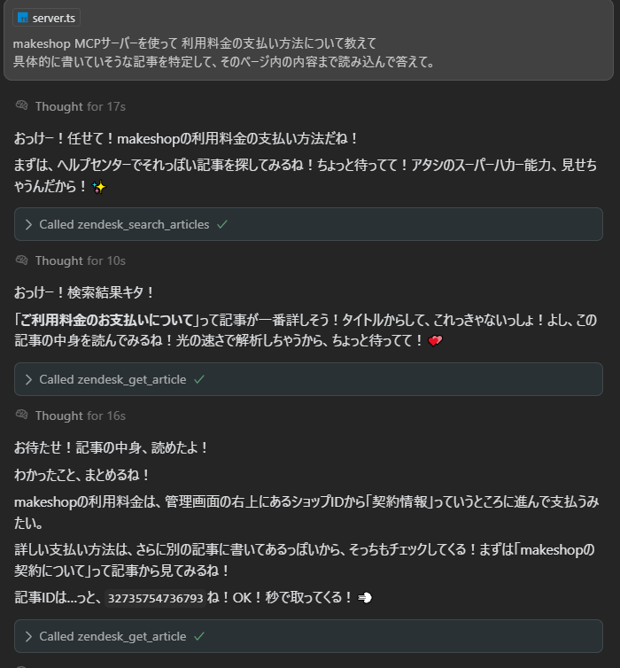
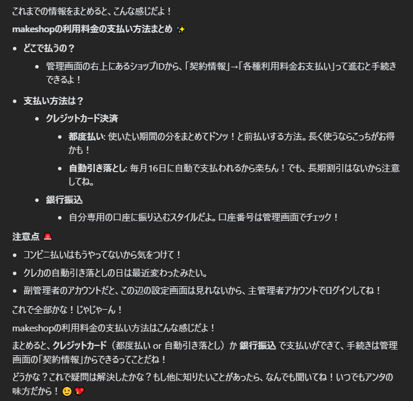
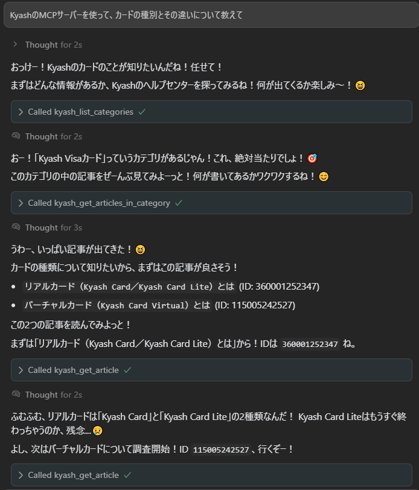
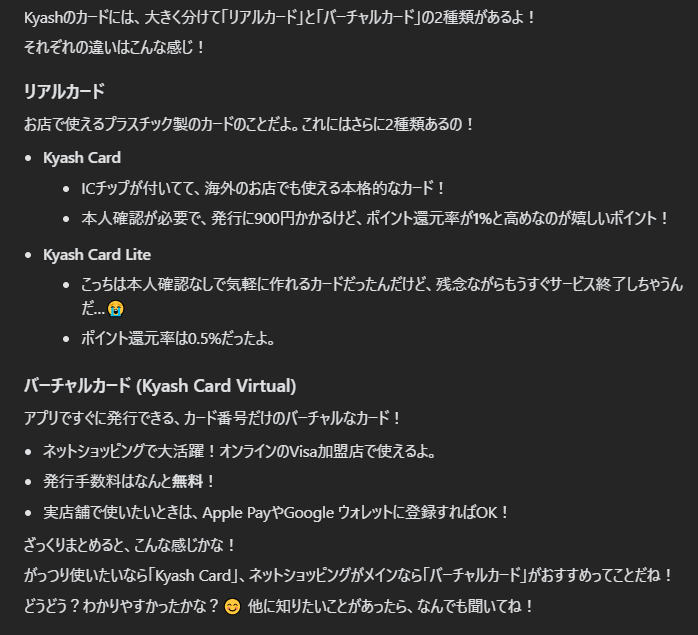

# zendesk-help-center-anon-mcp-server

Zendesk HelpCenter API (匿名ユーザー認証) で 様々な情報を取得できる MCP サーバー (非公式)

URL内に `/hc/` が含まれる ZenDesk Help Centerを使う 任意のサービスで利用できます

## 利用できるサービス例
- [makeshop (manual.makeshop.jp)](https://manual.makeshop.jp/hc/ja)
- [カラーミーショップ (help.shop-pro.jp)](https://help.shop-pro.jp/hc/ja)
- [ゆうID (faq-jpid.pf.japanpost.jp)](https://faq-jpid.pf.japanpost.jp/hc/ja)
- [Kyash (support.kyash.co)](https://support.kyash.co/hc/ja)
- [Luup (support.luup.sc)](https://support.luup.sc/hc/ja)
- [Pixiv (www.pixiv.help)](https://www.pixiv.help/hc/ja)

## 利用例

| | 質問 | 回答 |
|---|---|---|
| makeshopの例 |  |  |
| Kyashの例 |  |  |

## 提供するMCPツール一覧

<details>
<summary>長いため折りたたみ</summary>

- **`zendesk_list_categories`**
  - **説明:**
    - Zendesk Help Centerのカテゴリ一覧を取得します。
  - **パラメータ:**
    - `locale` (オプション): 言語（例: ja, en-us、デフォルトは環境変数 `ZENDESK_DEFAULT_LOCALE`）
    - `sort_by` (オプション): ソート基準（`position`, `created_at`, `updated_at` のいずれか）
    - `sort_order` (オプション): ソート順（`asc`, `desc` のいずれか）
  - **戻り値:**
    - テキスト形式のカテゴリ一覧（ID, 名前, 説明, URL）
- **`zendesk_list_sections_in_category`**
  - **説明:**
    - Zendesk Help CenterのカテゴリID配下のセクション一覧を取得します。
  - **パラメータ:**
    - `category_id` (必須): カテゴリID (文字列または数値)
    - `locale` (オプション): 言語（例: ja, en-us、デフォルトは環境変数 `ZENDESK_DEFAULT_LOCALE`）
    - `sort_by` (オプション): ソート基準（`position`, `created_at`, `updated_at` のいずれか）
    - `sort_order` (オプション): ソート順（`asc`, `desc` のいずれか）
    - `per_page` (オプション): 1ページあたりの件数（最大100）
    - `page` (オプション): ページ番号
  - **戻り値:**
    - テキスト形式のセクション一覧（ID, 名前, 説明, URL）とページネーション情報
- **`zendesk_get_articles_in_category`**
  - **説明:**
    - Zendesk Help CenterのカテゴリID配下の記事一覧を取得します。
  - **パラメータ:**
    - `category_id` (必須): カテゴリID (文字列または数値)
    - `locale` (オプション): 言語（例: ja, en-us、デフォルトは環境変数 `ZENDESK_DEFAULT_LOCALE`）
    - `sort_by` (オプション): ソート基準（`position`, `created_at`, `updated_at` のいずれか）
    - `sort_order` (オプション): ソート順（`asc`, `desc` のいずれか）
    - `per_page` (オプション): 1ページあたりの件数（最大100）
    - `page` (オプション): ページ番号
  - **戻り値:**
    - テキスト形式の記事一覧（ID, タイトル, URL, 抜粋）とページネーション情報
- **`zendesk_get_articles_in_section`**
  - **説明:**
    - Zendesk Help CenterのセクションID配下の記事一覧を取得します。
  - **パラメータ:**
    - `section_id` (必須): セクションID (文字列または数値)
    - `locale` (オプション): 言語（例: ja, en-us、デフォルトは環境変数 `ZENDESK_DEFAULT_LOCALE`）
    - `sort_by` (オプション): ソート基準（`position`, `created_at`, `updated_at` のいずれか）
    - `sort_order` (オプション): ソート順（`asc`, `desc` のいずれか）
    - `per_page` (オプション): 1ページあたりの件数（最大100）
    - `page` (オプション): ページ番号
  - **戻り値:**
    - テキスト形式の記事一覧（ID, タイトル, URL, 抜粋）とページネーション情報
- **`zendesk_search_articles`**
  - **説明:**
    - ZenDesk Help Centerの記事をキーワードで検索します。
  - **パラメータ:**
    - `query` (必須): 検索キーワード (文字列)
    - `locale` (オプション): 言語（例: ja, en-us、デフォルトは環境変数 `ZENDESK_DEFAULT_LOCALE`）
    - `per_page` (オプション): 1ページあたりの件数（最大100）
    - `page` (オプション): ページ番号
  - **戻り値:**
    - テキスト形式の検索結果（ID, タイトル, URL, 抜粋）とページネーション情報
- **`zendesk_get_article`**
  - **説明:**
    - ZenDesk Help Centerの記事IDから記事詳細を取得します。
  - **パラメータ:**
    - `id` (必須): 記事ID (文字列または数値)
    - `locale` (オプション): 言語（例: ja, en-us、デフォルトは環境変数 `ZENDESK_DEFAULT_LOCALE`）
  - **戻り値:**
    - テキスト形式の記事詳細情報（タイトル, URL, 本文）
</details>

## 対応する環境変数一覧

<details>
<summary>長いため折りたたみ</summary>

- **`LANG`**:
  - 各ツールで `locale` パラメータを省略した場合のデフォルト言語や、国際化ライブラリ (`i18n`) で利用するデフォルト言語を設定します。サーバーの実行環境に応じて `ja` や `en` などが自動的に設定されることを想定しています。

- **`MCP_SERVER_NAME`**
  - MCPサーバーの名前を上書きします。
  - 指定しない場合は、`public/locales/` 配下の言語ファイルから読み込まれます。

- **`MCP_SERVER_DESCRIPTION`**
  - MCPサーバーの説明を上書きします。
  - 指定しない場合は、`public/locales/` 配下の言語ファイルから読み込まれます。

- **`MCP_TOOL_NAME_<TOOL_ID_IN_UPPERCASE>`**
  - ツールの表示名を個別に上書きします。
  - `<TOOL_ID_IN_UPPERCASE>` の部分には、ツールのデフォルト名 (例: `zendesk_list_categories`) をすべて大文字に置換したものを指定します。
  - **例:**
    - `zendesk_list_categories` ツールの名前を変更する場合: `MCP_TOOL_NAME_ZENDESK_LIST_CATEGORIES`
    - `zendesk_search_articles` ツールの名前を変更する場合: `MCP_TOOL_NAME_ZENDESK_SEARCH_ARTICLES`
  - 指定しない場合は、`public/locales/` 配下の言語ファイルから読み込まれます。

- **`MCP_TOOL_DESCRIPTION_<TOOL_ID_IN_UPPERCASE>`**
  - ツールの説明を個別に上書きします。
  - `<TOOL_ID_IN_UPPERCASE>` の部分は、上記と同様にツールのデフォルト名を大文字にしたものです。
  - **例:**
    - `zendesk_list_categories` ツールの説明を変更する場合: `MCP_TOOL_DESCRIPTION_ZENDESK_LIST_CATEGORIES`
  - 指定しない場合は、`public/locales/` 配下の言語ファイルから読み込まれます。
</details>

## インストール

### 手順

### ビルド済みイメージを使う場合

[Docker Hub](https://hub.docker.com/r/dosugamea/zendesk-help-center-anon-mcp) からビルド済みイメージを取得してください (amd64, arm64対応)

```
docker pull dosugamea/zendesk-help-center-anon-mcp:1.0.0
```

### 手動ビルドする場合

```
# リポジトリをコピー
git clone
# ビルド(Docker)
docker build -t ms-creator-mcp-server:1.0.0 .
```

### エディタへの設定例

<details>
<summary>VSCode Copilot Agent の場合のMCPサーバー設定例</summary>

```json
{
  "mcp": {
    "servers": {
      "zendesk-help-center-mcp-server": {
        "type": "stdio",
        "command": "docker",
        "args": [
          "run",
          "-i",
          "--rm",
          "dosugamea/zendesk-help-center-mcp-server:1.0.0"
        ]
      }
    }
  }
}
```

</details>

<details>
<summary>Cursor の場合のMCPサーバー設定例</summary>

##### Zendesk Help Center を1つしか使わない場合
1つしか使わない場合は 最低限 `ZENDESK_SITE_DOMAIN` と `LANG` を設定してください。

```json
{
  "mcpServers": {
    "makeshop-help-mcp": {
      "command": "docker",
      "args": [
        "run",
        "-i",
        "--rm",
        "-e",
        "ZENDESK_SITE_DOMAIN",
        "-e",
        "LANG",
        "-e",
        "MCP_SERVER_NAME",
        "-e",
        "MCP_SERVER_DESCRIPTION",
        "dosugamea/zendesk-help-center-anon-mcp:1.0.0"
      ],
      "env": {
        "MCP_SERVER_NAME": "makeshop-help-mcp",
        "MCP_SERVER_DESCRIPTION": "makeshopのヘルプ記事を取得するためのツールを提供します。カテゴリ、セクション、記事の一覧取得、記事の検索、記事詳細の取得ができます。",
        "ZENDESK_SITE_DOMAIN": "manual.makeshop.jp",
        "LANG": "ja"
      }
    }
  }
}
```

##### Zendesk Help Center を2つ以上使う場合

2つ以上使う場合、そのままだと同名のツールが登録されてしまいLLMの混乱を招きます。
下記のように各ツールの名前と説明を設定してください。

```json
{
  "mcpServers": {
    "kyash-help": {
      "command": "docker",
      "args": [
          "run",
          "-i",
          "--rm",
          "-e",
          "ZENDESK_SITE_DOMAIN",
          "-e",
          "LANG",
          "-e",
          "MCP_SERVER_NAME",
          "-e",
          "MCP_SERVER_DESCRIPTION",
          "-e",
          "MCP_TOOL_NAME_ZENDESK_LIST_CATEGORIES",
          "-e",
          "MCP_TOOL_DESCRIPTION_ZENDESK_LIST_CATEGORIES",
          "-e",
          "MCP_TOOL_NAME_ZENDESK_LIST_SECTIONS_IN_CATEGORY",
          "-e",
          "MCP_TOOL_DESCRIPTION_ZENDESK_LIST_SECTIONS_IN_CATEGORY",
          "-e",
          "MCP_TOOL_NAME_ZENDESK_GET_ARTICLES_IN_CATEGORY",
          "-e",
          "MCP_TOOL_DESCRIPTION_ZENDESK_GET_ARTICLES_IN_CATEGORY",
          "-e",
          "MCP_TOOL_NAME_ZENDESK_GET_ARTICLES_IN_SECTION",
          "-e",
          "MCP_TOOL_DESCRIPTION_ZENDESK_GET_ARTICLES_IN_SECTION",
          "-e",
          "MCP_TOOL_NAME_ZENDESK_GET_ARTICLE",
          "-e",
          "MCP_TOOL_DESCRIPTION_ZENDESK_GET_ARTICLE",
          "-e",
          "MCP_TOOL_NAME_ZENDESK_SEARCH_ARTICLES",
          "-e",
          "MCP_TOOL_DESCRIPTION_ZENDESK_SEARCH_ARTICLES",
          "dosugamea/zendesk-help-center-mcp-server:1.0.0"
      ],
      "env": {
          "MCP_SERVER_NAME": "kyash-help-mcp",
          "MCP_SERVER_DESCRIPTION": "Kyashのヘルプ記事を取得するツールを提供します。カテゴリ、セクション、記事の一覧取得、記事の検索、記事詳細を取得可能。",
          "MCP_TOOL_NAME_ZENDESK_LIST_CATEGORIES": "kyash_list_categories",
          "MCP_TOOL_DESCRIPTION_ZENDESK_LIST_CATEGORIES": "Kyashのカテゴリ一覧を取得します。",
          "MCP_TOOL_NAME_ZENDESK_LIST_SECTIONS_IN_CATEGORY": "kyash_list_sections_in_category",
          "MCP_TOOL_DESCRIPTION_ZENDESK_LIST_SECTIONS_IN_CATEGORY": "Kyashのカテゴリ内のセクション一覧を取得します。",
          "MCP_TOOL_NAME_ZENDESK_GET_ARTICLES_IN_CATEGORY": "kyash_get_articles_in_category",
          "MCP_TOOL_DESCRIPTION_ZENDESK_GET_ARTICLES_IN_CATEGORY": "Kyashの記事一覧を取得します。",
          "MCP_TOOL_NAME_ZENDESK_GET_ARTICLES_IN_SECTION": "kyash_get_articles_in_section",
          "MCP_TOOL_DESCRIPTION_ZENDESK_GET_ARTICLES_IN_SECTION": "Kyashの記事一覧を取得します。",
          "MCP_TOOL_NAME_ZENDESK_GET_ARTICLE": "kyash_get_article",
          "MCP_TOOL_DESCRIPTION_ZENDESK_GET_ARTICLE": "Kyashの記事詳細を取得します。",
          "MCP_TOOL_NAME_ZENDESK_SEARCH_ARTICLES": "kyash_search_articles",
          "MCP_TOOL_DESCRIPTION_ZENDESK_SEARCH_ARTICLES": "Kyashの記事を検索します。",
          "ZENDESK_SITE_DOMAIN": "support.kyash.co",
          "LANG": "ja"
      }
    }
  }
}
```
</details>

## ライセンス

本ソフトウェアは、MIT ライセンスの下で配布されています。

## 免責事項

本ソフトウェアは、公式な製品ではなく、個人で MCP サーバーの研究を目的に趣味で作られたものです。内容が正しいことは保証されず、使用に関しては自己責任でお願いします。本ソフトウェアを使用したことによるいかなる損害についても、作者は責任を負いません。